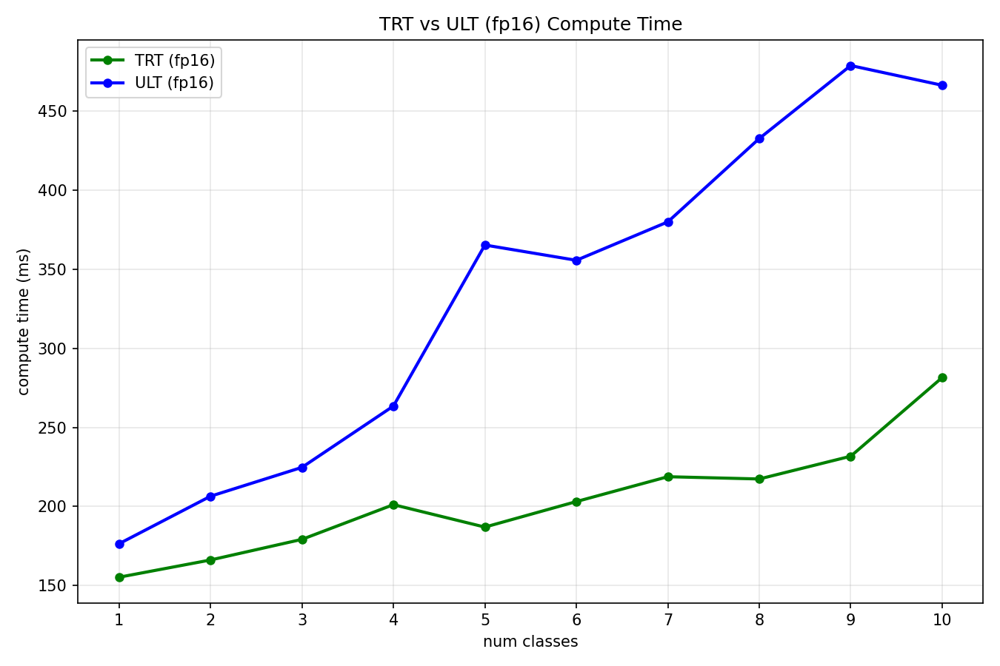

# SAM3 Tensor RT

This repo is a partial TensorRT implementation of [SAM 3](https://huggingface.co/facebook/sam3), designed with multi-class inference in mind. This implementation reuses the image encoding when there are multiple text inputs.

The TensorRT export must be run on the type of hardware it will be deployed on, i.e. you must export for a jetson on a jetson device.

### Tracing

The model currently traces the image at a fixed `(1, 3, 644, 644)` size. You can trace with batched images if you want, but the tracing function would have to be changed to handle a fixed size or to have that dimension be dynamic. 
By default I export the text encoder with 32 tokens.

Since SAM 3 is a gated model you will need to trace the model yourself once you get access to it on huggingface. Once you are granted access download the `sam3.pt` file and put it in the `models` directory.

Trace the model suing the `.trace` docker image. You will need an up to date nvidia driver on your device.
```[bash]
cd docker
./build-trace.bash
cd .. 
./run-trace.bash
```
This will bring you inside the docker image, then run: `export_all.py`

### Building CPP

To build the model in cpp use:
```[bash]
cd sam3tensorrt
cmake -S . -B build
cmake --build build
```
this with give you a `sam3` executable with you can run with `./sam3 <label>` which gives a `test_viz.png` file with the detections drawn on the original image.

### Performance

The model is traced from the [ultralytics](https://docs.ultralytics.com/models/sam-3) of SAM 3. This is a scalped version of the original version. It is traced at `float16` precision and benchmarked against it. 


The model is compared the ultralytics version it is traced from at the same precision. Most of the speed up comes on the decoding side, so this implementation is better for inferencing with many classes.
